# Assistant Dashboard Workflow

This diagram maps the conversational assistant implemented in `src/pages/AssistantRegister.jsx`, including saved-session recovery, FAQ branches, account creation, onboarding seeding, and the handoff to `/dashboard`.

```mermaid
flowchart TD
    Open["Open /assistant-register"] --> Saved{"Saved session found in localStorage?"}

    Saved -- Yes --> Restore["Show resume prompt"]
    Restore -->|Resume saved progress| Resume["Restore messages, answers, input, and history"]
    Restore -->|Start over| Ready
    Saved -- No --> Ready["__ready welcome step"]
    Resume --> Current["Return to saved step"]

    Ready --> Entry{"Choose action"}
    Entry -->|Yes, let's start| ProfileIntro["__profile_intro"]
    Entry -->|I want to learn more first| FAQMenu["__learn_more FAQ menu"]
    Entry -->|See footnotes| Footnotes["Show footnotes message"]
    Footnotes --> Entry

    FAQMenu --> FAQAnswer["__faq_answer"]
    FAQAnswer -->|Open another FAQ question| FAQMenu
    FAQAnswer -->|Continue onboarding| ProfileIntro

    ProfileIntro --> FirstName["first_name"]
    FirstName --> LastName["last_name"]
    LastName --> Email["email"]
    Email --> Phone["phone"]
    Phone --> Newsletter["newsletter_opt_in"]

    Newsletter -->|Yes| NewsletterTab["Open newsletter signup in a new tab"]
    Newsletter -->|No| Experience["__profile_started"]
    NewsletterTab --> Experience

    Experience -->|Yes, invested before| ExpYes["__experience_yes"]
    Experience -->|No, new to investing| ExpNo["__experience_no"]
    ExpYes --> Planned["planned_amount_bucket"]
    ExpNo --> Planned

    Planned --> Accredited{"sec_accredited"}
    Accredited -->|Yes| FundClarification["__fund_clarification"]
    Accredited -->|No| CrowdfundingIntro["__crowdfunding_intro"]
    Accredited -->|Not sure| Preference["investor_preference"]

    Preference --> FundClarification
    FundClarification --> Route{"determineInvestorRoute()"}
    Route -->|ACCREDITED| AccreditedIntro["__accredited_intro"]
    Route -->|CROWDFUNDER| CrowdfundingIntro

    CrowdfundingIntro --> SelectedFund["selected_fund"]
    AccreditedIntro --> SelectedFund
    SelectedFund --> Password["password"]
    Password --> PasswordConfirm["password_confirmation"]
    PasswordConfirm --> CreateAccount["__create_account"]

    CreateAccount --> Register["api.register(payload)"]
    Register --> Seed["seedOnboardingFromAssistant()"]
    Seed --> Handoff["__handoff account ready screen"]

    Handoff --> HandoffAction{"Next action"}
    HandoffAction -->|Continue to dashboard| Done["__done"]
    HandoffAction -->|View FAQ| PostFaq["__learn_more_after_completion"]
    HandoffAction -->|Start new registration| Restart["__restart"]

    PostFaq --> PostFaqAnswer["__faq_answer_after_completion"]
    PostFaqAnswer -->|Open another FAQ question| PostFaq
    PostFaqAnswer -->|Continue to dashboard| Done
    PostFaqAnswer -->|Start new registration| Restart

    Restart --> Ready
    Done --> Navigate["Navigate to /dashboard"]
```

## Key Notes

- The assistant is a guided registration flow, not the final investor dashboard.
- `seedOnboardingFromAssistant()` pre-fills onboarding `basic`, `experience`, `sec`, and `pathway` after account creation.
- The assistant stops after account setup and sends the user to `/dashboard` for profile completion, documents, verification, review, and funding.
- `determineInvestorRoute()` decides whether the user follows the `ACCREDITED` or `CROWDFUNDER` branch.
- The `Back` button returns to the last non-auto-advanced step.
- `Save for later` and the autosave effect persist the current session in `localStorage`.
- If saved progress exists, the page prompts the user to resume or start over.
- If registration fails because the email already exists, the flow pushes the user back to the `email` step.

## Source File

- `src/pages/AssistantRegister.jsx`
