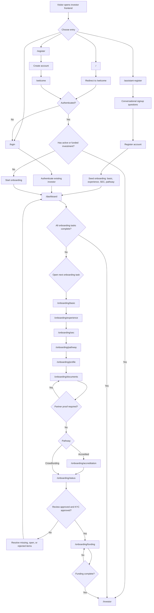

# Investor Frontend Workflow

This diagram reflects the route flow implemented in `src/App.js`, the onboarding pages under `src/pages/onboarding`, and the assistant handoff in `src/pages/AssistantRegister.jsx`.

For the assistant-only flow, see `docs/assistant-dashboard-workflow.md`.

## Key Notes

- `/` redirects to `/welcome`.
- `/onboarding` redirects to `/dashboard`, so the onboarding dashboard acts as the hub for all next-step navigation.
- `ProtectedRoute` sends unauthenticated users to `/login`.
- `ProtectedRoute` also redirects users with an `active` or `funded` investment from onboarding entry pages to `/investor`.
- The assistant flow creates the account and pre-populates onboarding state with basic profile, experience and intent, SEC answers, and the selected pathway.
- The assistant then hands the user off to `/dashboard` to finish full profile details, document upload, accredited verification when required, review, and funding.
- `ReviewStatus` automatically forwards the user to `/onboarding/funding` once the package review is approved and KYC is approved.
- `FundingInstructions` can loop while an external purchase is still awaiting proof or admin review before the user fully transitions to `/investor`.

## Source Files

- `src/App.js`
- `src/components/ProtectedRoute.jsx`
- `src/lib/auth.js`
- `src/lib/onboarding.js`
- `src/pages/Register.jsx`
- `src/pages/Login.jsx`
- `src/pages/AssistantRegister.jsx`
- `src/pages/onboarding/WelcomePage.jsx`
- `src/pages/onboarding/BasicProfileForm.jsx`
- `src/pages/onboarding/ExperienceAndIntent.jsx`
- `src/pages/onboarding/SECScreening.jsx`
- `src/pages/onboarding/PathwaySelection.jsx`
- `src/pages/onboarding/FullProfileForm.jsx`
- `src/pages/onboarding/DocumentUpload.jsx`
- `src/pages/onboarding/AccreditedVerification.jsx`
- `src/pages/onboarding/ReviewStatus.jsx`
- `src/pages/onboarding/FundingInstructions.jsx`
- `src/pages/onboarding/Dashboard.jsx`
- `src/pages/InvestorPanel.jsx`
